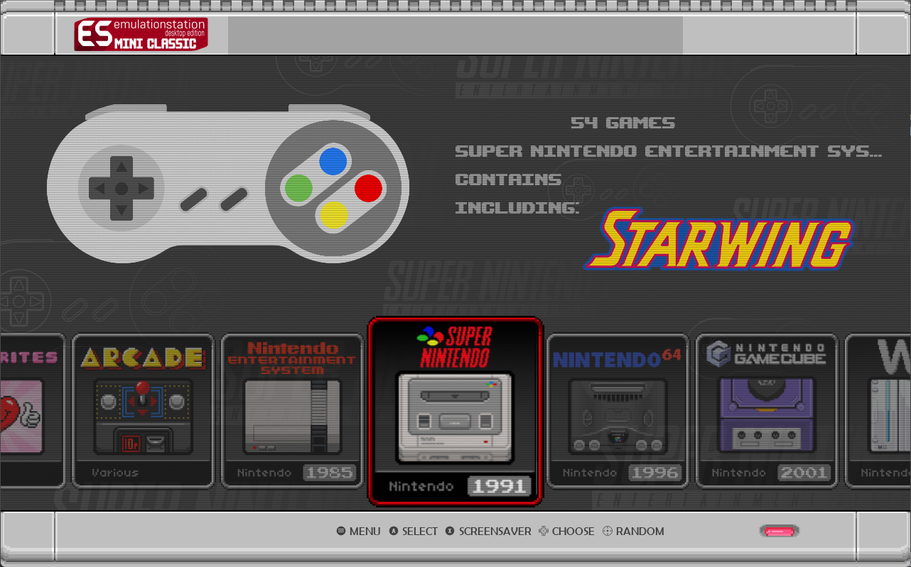
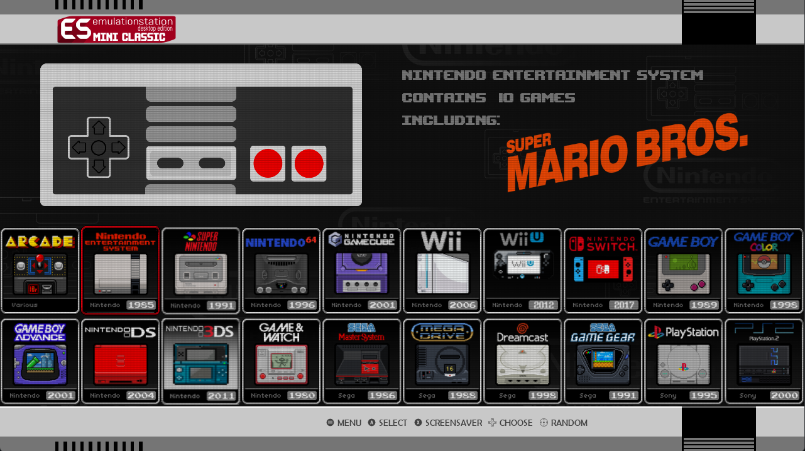

# ESDEmini for EmulationStation Desktop Edition

ESDEmini is a theme set for ES-DE that supports all systems as well as the latest application features.

Thanks to Simon Butler for additional pixel art for Sinclair Next (available to buy here https://dinosaur-pie.co.uk/ )

The following options are included:

12 variants:

- 6 console Types
	- SNES (EUR)
	- SNES (US)
	- NES
	- Mega Drive
	- Master System
	- Playstation

- 2 View type per console
	- Grid View
	- Carousel View

11 color schemes:

- SNES
- USNESA
- NES
- FAMICON
- SEGA
- MASTER SYSTEM
- HYSTORIA
- LIMITED EDITION
- ITS A MARIO
- GOLD
- MRS LEphant

4 aspect ratios:

- 16:9
- 4:3
- 16:10
- 21:9

